.. _day1:

.. title:: Introduction to Kubernetes

Day 1 - Getting to understand how to run applications
=====================================================

Introduction
------------

To get ready for today's part of the project John has set for him self the following actions:

- General understanding
- YAML Files for deployments
- Build the test environment

General understanding
^^^^^^^^^^^^^^^^^^^^^

John has been reading some articles and sees a lot of YAML files being created and used for the deployment of applications. His question is instantly, "How do I create these YAML files and what should be in there??". Before diving into the YAML files and what needs to be in them, he searched for Kubernetes Terminology and found https://www.bluematador.com/learn/kubernetes-glossary. This article is providing a description of the different terms that are very common in the K8s world.

Terminology
***********

- Cluster
  A cluster is a set of nodes, or worker machines, that containerized applications run on. These nodes can be physical machines or virtual machines. If you are running Kubernetes you are running a cluster. A cluster will have at least one node.
- Node
  Nodes are the machines, either physical or virtual, in your cluster that your applications run on. Nodes perform work dictated by the Kubernetes control plane. Each node runs kubelet to communicate with the master nodes and regulate itself, kube-proxy (or equivalent) to handle networking, and the container runtime.
- Pod
  The most basic Kubernetes object. A pod consists of a group of containers that are running in your cluster. Most commonly, a Pod runs a single primary container. However, many teams run optional sidecar containers (helper containers) in order to add more functionality like monitoring
- Service
  A Kubernetes Service groups a set of pods together and offers a way to make them accessible as a network service through the DNS name of the Service. One way you can configure your Service is by using a YAML manifest. There are four types of Services in Kubernetes: ClusterIP, NodePort, LoadBalancer, and ExternalName.
- Deployment
  A deployment is a resource object in Kubernetes that provides declarative updates to applications. It manages the scheduling and lifecycle of pods. They provide several key features for managing pods, including rolling updates of pods, the ability to rollback, and easily scaling pods horizontally.
- Secrets
  Often a Kubernetes Pod will need to leverage sensitive information like passwords, API keys, ssh keys, OAuth tokens, and more. A Secret is a Kubernetes object that stores this confidential information so that Pods can use it without the data being shown. Secrets are exposed to containers either as a file in a volume mount or through environment variables.

YAML Files for deployments
**************************

Now John understands the high level basics of the components and the sort of YAML files, he searches for deeper info on the how-to YAML for Kubernetes. A search led him to https://www.mirantis.com/blog/introduction-to-yaml-creating-a-kubernetes-deployment/. This article describes in "simple" language what it means to create a YAML file and what MUST be in those files to deploy applications. On YouTube he also found good examples and explanations or at least by reading the titles https://www.youtube.com/watch?v=Krpb44XR0bk&list=PLy7NrYWoggjwPggqtFsI_zMAwvG0SqYCb

"Ok, this gives me some guidelines of how to build the YAML files... Now put it to practice, but I need a testing environment. How to build one???"

Build the Test environment
^^^^^^^^^^^^^^^^^^^^^^^^^^

From his last endeavour John has been working on his laptop through it entirely and wants to investigate if that can be done again. It makes life easier as there is no other dependency then his laptop. No internet connection, no network connection, although for searching answers that would be daft, but in general no other dependency on other hardware. He searches the internet and finds a few solutions. The first one is what he likes the most as it seems to be available on all platforms and uses virtualbox where it "installs" a VM that is going to be used. It is called Minikube (https://kubernetes.io/docs/setup/learning-environment/minikube/). Kind is the other version he sees, but that seems to be running the k8s nodes as Docker containers (https://kubernetes.io/docs/setup/learning-environment/kind/). The advantage of Kind is that it can run a multi node cluster. Minikube is a single k8s cluster as a VM in VirtualBox, or any other supported hypervisor. As John is still in the start-up phase of his knowledge he starts with Minikube, and decides that maybe later have a look at Kind...

Docker Desktop
***************************

As k8s is dependent on containers and John may need to change the image, he checks that Docker Desktop is still installed and running on his laptop. As this is not the case he downloads the Docker Desktop at https://www.docker.com/get-started for his laptop and installs it. At the same time he checks that he still has the Docker Hub account, he created one before so he should be fine. He knows that if he didn’t know it anymore he could create a new account. That way he can have the created images uploaded. Also the Docker Desktop needs the account to be started...

Installation of kubectl BEFORE minikube
***************************************

During the reading of the article (https://kubernetes.io/docs/tasks/tools/install-minikube/) John reads that kubectl MUST be installed first. So he follows the article for his Mac as described in the article https://kubernetes.io/docs/tasks/tools/install-kubectl/. The steps are:

.. code-block:: bash
    
    curl -LO "https://storage.googleapis.com/kubernetes-release/release/$(curl -s https://storage.googleapis.com/kubernetes-release/release/stable.txt)/bin/darwin/amd64/kubectl"
    chmod +x ./kubectl
    sudo mv ./kubectl /usr/local/bin/kubectl and provides his password
    kubectl version --client to see if the installation steps were successful

Installation of VirtualBox
***************************************
Minikube is dependent on a virtualisation layer. As he is running on a Mac he has the option between VirtualBox and VMware’s Fusion. As the latter one is costing money, and he doesn’t wanna spend too much on software for his project he decides to get VirtualBox installed. He downloads the installation and expansion pack and installs them.

Installation of Minikube
***************************************

He follows the guide on https://kubernetes.io/docs/tasks/tools/install-minikube/ to install the environment. He follows the curl command to get the installation

.. code-block:: bash 

    curl -Lo minikube https://storage.googleapis.com/minikube/releases/latest/minikube-darwin-amd64 \
    && chmod +x minikube

as his laptop is Mac OS.

And follows with the next command to make it possible to run the command ``minikube`` from the terminal without making any changes to the PATH variable ``sudo mv minikube /usr/local/bin``.
He types the password to get the sudo command to work.

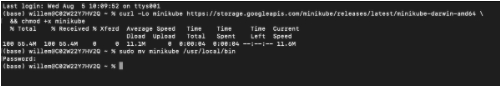

To confirm the installation he runs ``minikube start --driver=virtualbox*`` as he is using VirtualBox for the VM. 

.. note:: 
    For other driver look here: https://kubernetes.io/docs/setup/learning-environment/minikube/#specifying-the-vm-driver

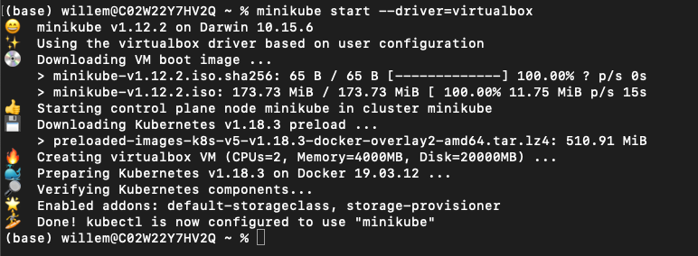

The "installer" downloaded an iso image for the minikube installation and created a VM in VirtualBox.

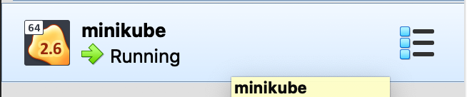

He runs the ``minikube status`` command to see if the k8s single cluster is running.

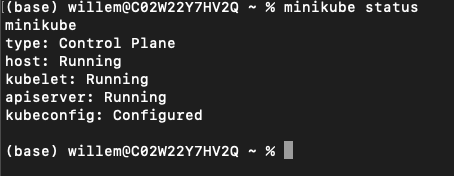

"Yep. That’s what I need to see according to the manual. What’s next?"

Interact with k8s cluster
***************************************

John reads the document that he used to install minikube and reads that he needs to run ``kubectl`` to interact with the k8s minikube environment.
He runs ``kubectl get nodes`` to see if he is able to connect and interact. Yes he gets a reply and sees a node. 

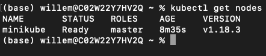

Before he starts exploring, he wants to have something running, so he can see something. In the article there was a mention of getting a “pod” running. John remembers that a Pod is the smallest deployable object and can be one of more containers.

Deployment of a test pod
***************************************
He runs the mentioned command ``kubectl create deployment hello-minikube --image=k8s.gcr.io/echoserver:1.10`` to get a pod deployed to the minikube environment.
After he runs the command he wants to see the status of the pods. To do this he runs ``kubectl get deployments`` and sees that, after rerunning the command again, the deployment has the AVAILABLE (1/1) status and is READY (1/1)

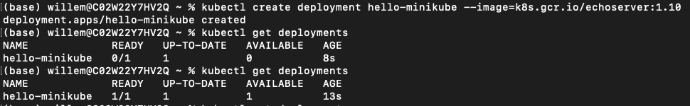

"Ok so the pod is running... But how do I interact with that?" Reading on in the article, he reads that the port needs to be exposed to the outside world by using ``kubectl expose deployment hello-minikube --type=NodePort --port=8080`` he runs that command to see what happens.
Then he runs ``kubectl get pods`` to get the status of the pods running.

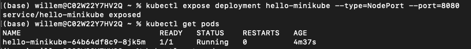

To see what this pod is doing he runs ``minikube service hello-minikube --url`` to get the url where the hello-world is running. He then opens the URL he got from the command using a browser and sees some information..

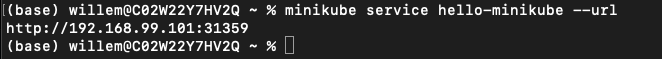

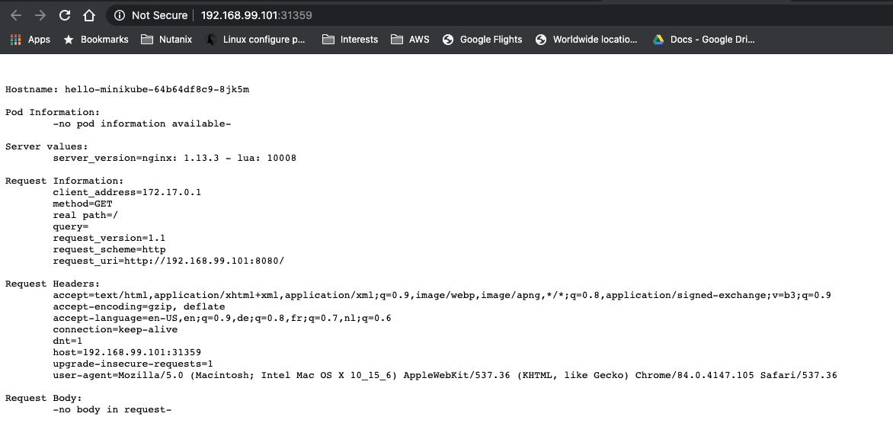

"So far all is exactly as in the article, so all seems to work as expected..."

Cleanup the installation test
***************************************

"Ok let’s get all back to the installation phase... Cleaning up all created stuff, so I have a clean minikube environment to start testing..", John thinks.
He runs the following commands to clean up his minikube environment:

- ``kubectl delete service hello-minikube`` ; to delete the exposed port
- ``kubectl delete deployment hello-minikube`` ; to delete the deployment of the pod
- ``kubectl get service``; checking if the exposed port has been deleted
- ``kubectl get deployment``; checking to see if the deployment has been deleted.

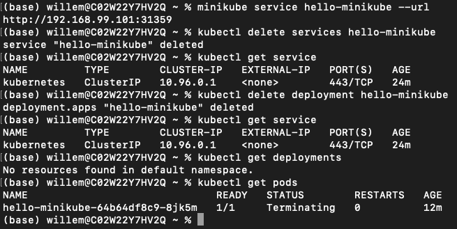

After a few seconds even the ``kubectl get pods`` is showing the "No resources found.." message. His minikube environment is clean and ready for testing tomorrow.

Stop the minikube environment
***************************************
John is done for today and stops his minikube environment using the command ``minikube stop``

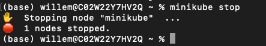
