.. _day2:

.. title:: Introduction to Kubernetes

Day 2 - Getting the earlier build images up and running in k8s
==============================================================

Introduction
------------

To get ready for today's part of the project John has set for him self the following actions:

- Start the tes environment
- Preparation for the project
- Create YAML files
- Pod or deployment?

Pre-requirements
^^^^^^^^^^^^^^^^

From his earlier project, getting to understand Docker and Docker Swarm, John had saved his Visual Code installation. 

He also knows that if the installation would have been deleted, he could quickly recreate the probably needed resources.

- Downloaded and installed a tool so he can syntax highlighting for the file he needs to create. Microsoft Visual Code (https://code.visualstudio.com/)

- Added plugins into visual code so he has syntax highlighting for
    
  + Container (https://code.visualstudio.com/docs/containers/overview)
  + Bash (https://marketplace.visualstudio.com/items?itemName=mads-hartmann.bash-ide-vscode)
  + Python (https://marketplace.visualstudio.com/items?itemName=ms-python.python)
  + Git integration in Visual Code (https://marketplace.visualstudio.com/items?itemName=eamodio.gitlens)

He now adds a few extra extensions to the installation so he gets more K8s integration. The extensions are:

- Kubernetes (https://marketplace.visualstudio.com/items?itemName=ms-kubernetes-tools.vscode-kubernetes-tools)
- Kubernetes Templates (https://marketplace.visualstudio.com/items?itemName=lunuan.kubernetes-templates)

Start minikube
^^^^^^^^^^^^^^

To be able to test the YAML files, John starts his minikube environment using **minikube start**.
After that he runs **kubectl get node** and **minikube status** to make sure all it up running and ready to go.

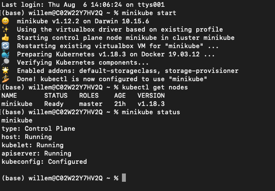

"All good... Let’s get cracking..."

Preparation for the project
^^^^^^^^^^^^^^^^^^^^^^^^^^^

John creates a Github repo called k8s-test-proj in his github repo and uses Git Desktop to clone the data. That way when something happens to his machine, at least he has some backup, can move to another machine or share his code with others.

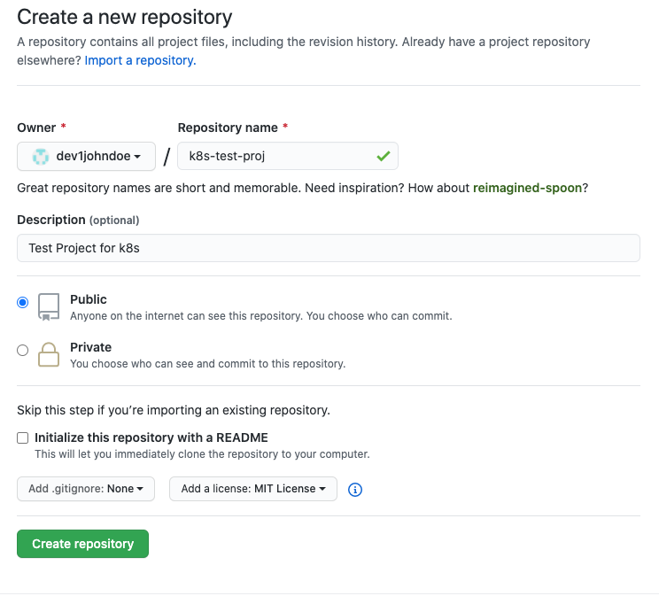

After the repository has been created, John clicks on the Code button and clicks on the clipboard icon to get the URL for his repo.

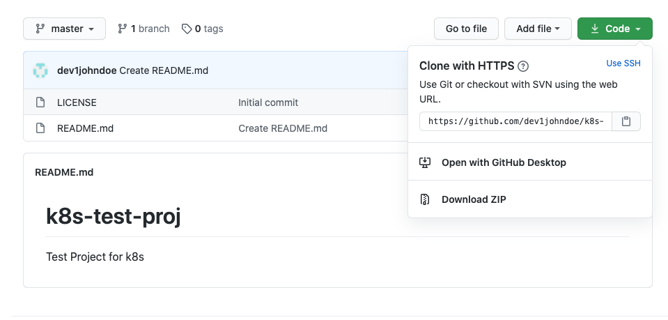

He then opens his Git Desktop and Clones the Repo by clicking on the Add button -> Clone A repository 

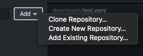

He selects the URL Tab and copies the URL in. He also makes sure that the Local Path is pointing to the correct location on his laptop.

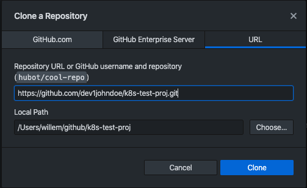

And clicks the Clone button. This will have cloned his Repo to his local machine.

Collect all information in one place
^^^^^^^^^^^^^^^^^^^^^^^^^^^^^^^^^^^^

As John has already created some stuff like Dockerfiles and other information he wants to get all in the GitHub repo he just cloned. That way he has all resources built and to be built at one location.. So he copies all the files he created from the earlier Docker project into the cloned GitHub repo location (all can be downloaded :download:`here <../downloads/k8s-test-proj-master.zip>`). The location looks like this (after extraction):

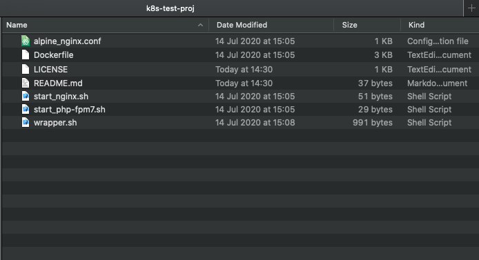

He now opens the Git Desktop and sees that there are files added in the interface.

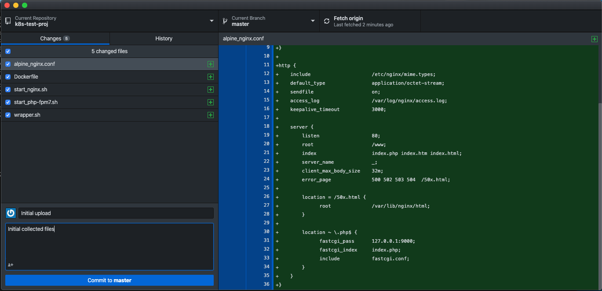

To get all the files synchronised into the Repo on Github, John followed these steps:

#. Provide text in the Summary (required) field; he decided to type “Initial upload”
#. In the bigger text field he types Initial collected files
#. Click Commit to master
#. Clicked on the right hand side the Push Origin button to get to info uploaded into the repo on github.

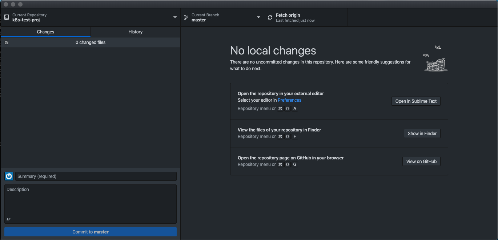

On the Github page, after refreshing the page he sees that all has been uploaded.

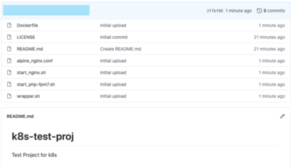

Getting ready
^^^^^^^^^^^^^

To get the earlier build images into K8s, John needs to create YAML files. To get too start with these YAML files he opens Visual Code and Opens the directory where the clone of his Repo is located on his Laptop.

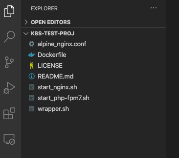

As John is not a big fan of switching between windows, Visual Code and Terminal, to debug/test YAML files, he opens a new Terminal in Visual Code via Terminal -> New Terminal

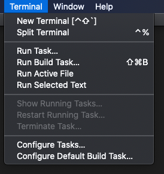

This opens a new Terminal, in the lower pane of Visual Code, in the directory he navigated to. He runs **minikube status** to see if the terminal works as expected, and it did.

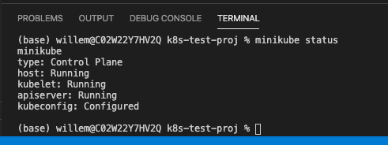

Create latest container
^^^^^^^^^^^^^^^^^^^^^^^

John wants to get ready to deploy his earlier images. To make sure he has the latest container images on this laptop, he runs in the terminal windows in Visual Code (VC) the command **docker build -t dev1johndoe/nginx:2.0** . to have his images builds. He also tags it as a 2.0 version and adds his username of docker hub to the name of the tag. That way he can easily upload it to docker hub.
After the build ends successfully he runs **docker image ls** to see if the image is on his machine. Yes it is there.

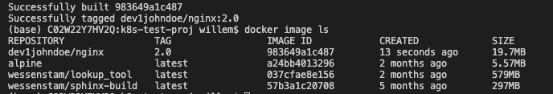

"Ok now how to get that image as a container in my minikube environment???"

Create POD YAML file
^^^^^^^^^^^^^^^^^^^^

John creates a new file called **nginx-pods-k8s.yaml** in VC and starts to type away. He starts to type k8 and waits a few seconds and see a popup being presented by one of the Extensions in VC.

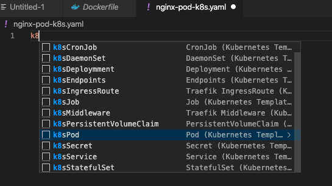

He clicks on the k8sPod and a lot of information is getting put on the screen.

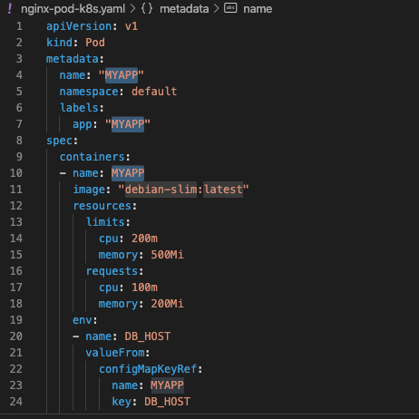

He makes changes to those things he knows. The YAML files looks after the changes like this:

.. code-block:: yaml

    apiVersion: v1
    kind: Pod
    metadata:
    name: web-pod
    namespace: default
    labels:
      app: web
    spec:
    containers:
      - name: nginx-server
        image: "dev1johndoe/nginx:2.0"
        ports:
            - containerPort: 80

He saves the file and runs **kubectl apply -f nginx-pod-k8s.yaml** to see if the pod gets created and is running. The command returns **pod/web-pod created**. John is happy that this has worked and runs **kubectl get pod** to see the status of the pod. He sees an error under the status and tries to understand what has happened.

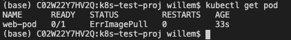

"Hang on... I had the same as with the Docker Swarm, the nodes could not pull the images for the repository... Ah I haven’t uploaded the image to the docker hub registry!! Let’s fix that!"
John runs the command **docker login** to login to the docker hub and runs after he gets the Login Succeeded message **docker push dev1johndoe/nginx:2.0** to get the image pushed into the repo.

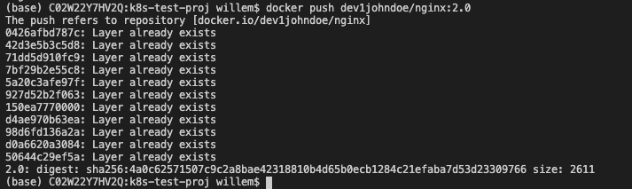

Now that the image is uploaded to the repo he checks that the repo is still set as public.

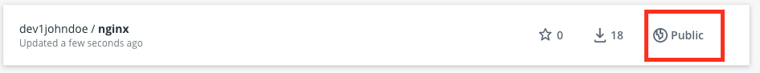

All good, now let’s run that command again **kubectl apply -f nginx-pod-k8s.yaml** and sees what happens... He repeats **kubectl get pods** until he sees that his nginx server is running. So that pull worked now and the pod seems to be running.

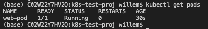

"Now how do I get access to the Pod??? I know the nginx is running on port 80, but how to interact with it???" He tried using the command **kubectl get pods -o wide** to get more information and sees an IP address of which he knows he cannot get to as that is internal to K8s... "Ahhhhh… Ok let me see what I need to do… ", he thinks. Searching the internet he found https://kubernetes.io/docs/concepts/services-networking/connect-applications-service/ where he reads the command **kubectl expose**. "Hmm let’s try this, even though we are using a deployment, but a pod in the YAML...".

John runs **kubectl expose pod web-pod**  to see what happens and got returned from the command **service/web-pod exposed**. "Wait, would that mean I can interact with the nginx server???. But again what is the IP address?"
John runs **kubectl get services** to see if this provides a clue. "Hmm no not really. All IP addresses are 'internal' k8s IP addresses that I cannot use." He tries some other commands, after reading some articles, like **kubectl describe service web-pod**, but still no good answer. Until he ran **minikube service web-pod**. That Command returned an error message: **service default/web-pod has no node port!** "Hmmmmmm.. That might lead to the solution. I remember that kubectl get service gave me only ClusterIP as the type. Let’s run **kubectl expose pod web-pod --type=NodePort** and see what it does….(https://stackoverflow.com/questions/52522570/how-to-expose-a-kubernetes-service-on-a-specific-nodeport)"

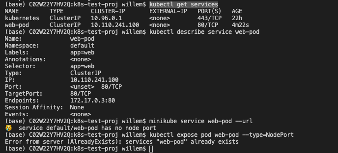

That lead into an issue as it mentions that *service already exists*. To delete the service John ran **kubectl delete service web-pod** to get the service deleted and ran **kubectl expose pod web-pod --type=NodePort** to see the result. "Hmm all good now, but what is the difference??". He runs **kubectl get service** and sees that the **NodePort** has been set to *<unset> 30261/TCP*. He tries to run **minikube server web-port --url** to get the IP address and the URL of the nginx server.

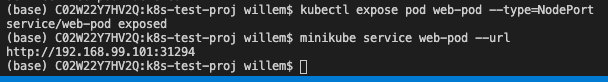

He opens the URL in the browser and gets 403 Forbidden error… As we haven’t given it any information that might be correct. John knows that using the command **docker exec -it <CONTAINER_NAME> /bin/sh** he would be able to get into the container. Would k8s also have such a construct. After some research on the internet he found the answer; YES. **kubectl exec -it <POD_NAME> <COMMAND>** is the k8s equivalent. He runs that command and makes the changes needed to get into the container, **kubectl exec -it web-pod /bin/sh**. He is now in the container as his prompt drops back to just the “/” sign. He uses **vi** to create a small index.html file in the /www directory. The content of the index.html file is 

.. code-block:: bash

    <html>
    <body>
    <h1>hallo this si the container in k8s</h1>
    </body>
    </html>
 
He saves the file using **<ESC>:wq!** and drops out of the container using the **<CTRL>+D** key combination. Back at the prompt of his laptop he runs **minikube service web-pod** and sees that the browser windows that opened shows his just created html file. "Hahahahaha great that works!".

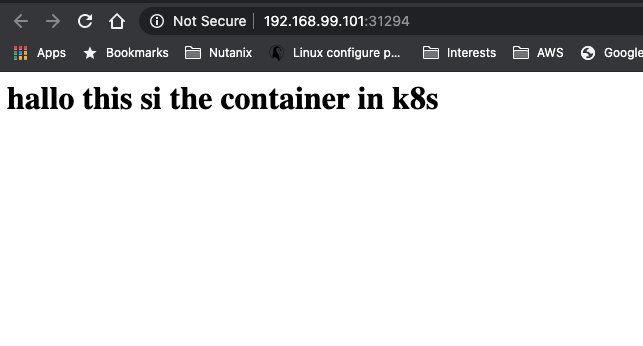

Now he wants to get a step further. How can he have a YAML file that has the pod AND the network as that would make things way easier...?
He deletes all that is running in the minikube environment so he has no interference with the existing stuff… The following commands are run by him to clean it all out:

- **kubectl delete service web-pod**; to delete the exposed port
- **kubectl delete pod web-pod**; to delete the pod that we have deployed earlier.

Then he runs the **kubectl get pods** and **kubectl get services** to see all has been deleted.

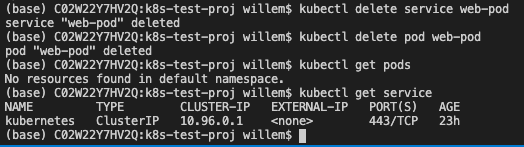

Ok we have a clean minikube again…. Let’s dive into creating a combined YAML file…

Combine pods and network YAML
^^^^^^^^^^^^^^^^^^^^^^^^^^^^^

John creates a new yaml file called **nginx-pod-network-k8s.yaml** where he copied the content from the Pod part. The other part, the networking part, is going to be a search on the internet. He found that the “---” symbol needs to be used to "split" objects in the YAML file (https://kubernetes.io/docs/concepts/cluster-administration/manage-deployment/).
So that is lead number one….

John found https://kubernetes.io/docs/concepts/services-networking/connect-applications-service/ which gave some insights on the **kubectl expose** command he used.

So he combines the service (expose) and the pod together in the new YAML file.

.. code-block:: yaml

      apiVersion: v1
      kind: Pod
      metadata:
      name: web-srv
      namespace: default
      labels:
        app: web
      spec:
      containers:
        - name: nginx-server
          image: "dev1johndoe/nginx:2.0"
          ports:
            - containerPort: 80
      ---
      apiVersion: v1
      kind: Service
      metadata:
      name: nginx-svc
      labels:
        app: web
      spec:
      type: NodePort
      ports:
      - port: 80
        protocol: TCP
      selector:
        app: web

During the creation of the YAML file he begins to understand the way the file works with respect to the Service part. The *selector*: line in the YAML file is *pointing to the label of the POD for which the port must be 'opened'/connected*. If that doesn’t match, the port is not forwarding the traffic into the container/pod!!!. The selector line seems to be a kind of a query to which the service must 'bind' itself using the label of the Pod...

He then runs **kubectl apply -f nginx-pod-network-k8s.yaml** and runs **minikube service niginx-svc** (as that is the name of the service) to see if he gets the error 403 again. John remembered that images are ReadOnly! Any changes made are gone in a new deployment.

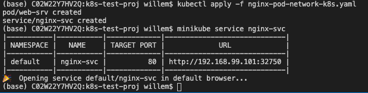

And yes that seems to work…

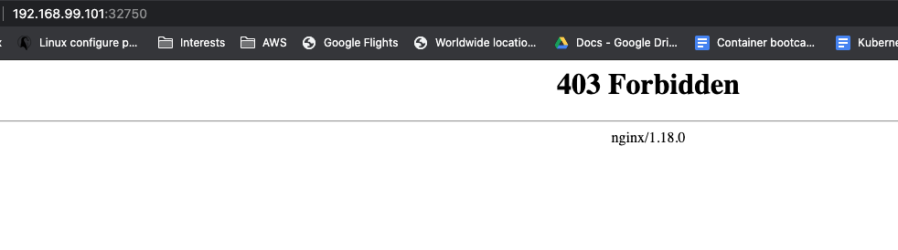

He also noticed that the port has changed again. It would be great if we can have that as a “static” port number… he searches the internet and finds the parameter **nodePort**: (https://stackoverflow.com/questions/43935502/kubernetes-nodeport-custom-port). Let’s use that in the YAML file. He adds the parameter in the ports: part of his YAML file and sets the value to 32222.

.. code-block:: yaml

    spec:
    type: NodePort
    ports:
    - port: 80
      protocol: TCP
      nodePort: 32222
    selector:
      app: web

He also read that using the **kubectl apply -f** command just makes changes from the YAML file. Meaning that if there is a change to the configuration John doesn’t have to delete and redeploy everything. So he runs **kubectl apply -f nginx-pod-network-k8s.yaml** to see what the effect is...
The command returns a line that says **configured** and that is for the service where he just made a small change. Let’s see...
He opens the earlier browser from the minikube service command and changes the port number to 32222, as set in the YAML file, and sees that he gets a response. Also the **minikube service nginx-svc --url** shows the same url and port...

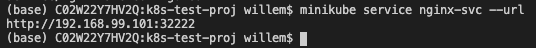

Deployment or pod?
^^^^^^^^^^^^^^^^^^

John is still not sure what the difference is between a pod and a deployment. He searches the internet and reads in this article what he is looking for: https://stackoverflow.com/questions/41325087/what-is-the-difference-between-a-pod-and-a-deployment#:~:text=Pods%20%2D%20runs%20one%20or%20more,right%20number%20of%20them%20exist.

So Deployments can have multiple pods that consist out of multiple containers... Especially the line: "Monitors the state of each pod, updating as necessary" is something that he finds interesting. He reads on and tries to create a deployment YAML.
He creates a new file **nginx-deployment-k8s.yaml** in VC and starts to combine the things he read from the last created YAML file into a deployment YAML. The content of the file he creates looks like this:

.. code-block:: yaml

    apiVersion: apps/v1
    kind: Deployment
    metadata:
    name:  nginx-deployment
    namespace: default
    labels:
      app:  web
    spec:
    selector:
      matchLabels:
        app: web
    replicas: 1
    template:
      metadata:
        labels:
          app:  web
      spec:
        containers:
        - name: nginx-server
          image: "dev1johndoe/nginx:2.0"
          ports:
            - containerPort: 80
    ---
    apiVersion: v1
    kind: Service
    metadata:
    name: nginx-svc
    labels:
      app: web
    spec:
    type: NodePort
    ports:
    - port: 80
      protocol: TCP
      nodePort: 32222
    selector:
      app: web

He runs **kubectl delete -f nginx-pod-network-k8s.yaml** to get a clean system again and makes sure the webpage is not replying using the browser he had opened earlier. "No reply, just a message that the connection is refused. Ok, so now I’m 100% sure nothing is running that replies to HTTP requests..."

On the clean minikube environment he runs **kubectl apply -f nginx-deployment-k8s.yaml** to get the YAML running…. 

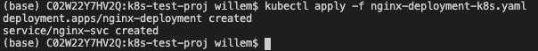

It seems to have worked… He refreshes the web browser and to his excitement the page is throwing the known 403 error again!!! "YES YES YES!!!"

He checks a few things to understand what has happened.

- **kubectl get pods**; just to see if he sees one pod
- **kubectl get services**; to see that there is a service called nginx-svc
- **kubectl get deployments**; to see if the is a deployment running

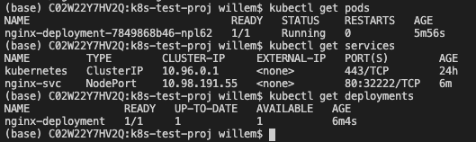

So let’s see if we can have multiple pods by changing the **replicas** parameter in the **nginx-deployment-k8s.yaml** file. He changes that parameter to the value of **2**, 

.. code-block:: yaml

    ...
    selector:
      matchLabels:
        app: web
    replicas: 2
    template:
      metadata:
    ...
saves the file and **runs kubectl apply -f nginx-deployment-k8s.yaml** to see the outcome by running **kubectl get pods**.

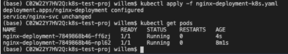

"Ha, two pods running in my minikube. Exactly what I hoped there would be!!!".

John closes or shuts down all used software so he can have a good night’s rest. "Tomorrow I’m going to see if we can get the containers to work with external storage..."
