.. _day3:

.. title:: Introduction to Kubernetes

Day 3 - Getting the external storage in the container and ingress
=================================================================

Introduction
------------

To get ready for today's part of the project John has set for him self the following actions:

- Create a NFS server
- Understand the external storage concept in k8s
- Create Persistent Volumes (PV) and PV Claims (PVC)
- Use of Ingress Controller and Ingress Rules

Start the test environment
^^^^^^^^^^^^^^^^^^^^^^^^^^

John had a good night’s sleep and starts his environment. He opens VC and the terminal screen. In the terminal he runs ``minikube start``. The minikube is active, he runs ``docker version`` to make sure his docker daemon is also running before moving on.
"Hmmm that throws an error...Cannot connect to the Docker daemon at unix:///var/run/docker.sock. Is the docker daemon running?". 

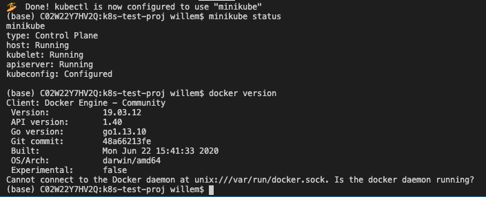

He checks that the docker desktop is running and sees it is not. He starts the Docker Desktop and reruns the ``docker version`` command.

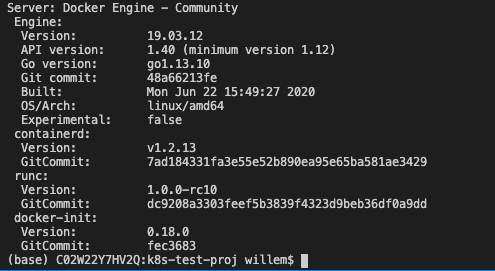

That’s more like it. Ok let’s get moving on...

NFS Server on Alpine as a VM
^^^^^^^^^^^^^^^^^^^^^^^^^^^^

John wants to reuse his earlier used nfs server based on a Alpine Linux VM. He tries to remember where he put the VM, but seems not to be able to find it. He has saved the article he used to build the NFS server...

The article he saved is https://wiki.alpinelinux.org/wiki/Installation to install Alpine as a VM. After the installation of Alpine he updated and upgraded the Operating System, using the ``apk update`` and ``apk upgrade`` commands. Now comes the hard part, installing and configuring a NFS server. But that was easier than he expected. He found an article that describes what the steps are to install the needed software and what to configure so he would have a NFS export that he intends to use for his containers (https://wiki.alpinelinux.org/wiki/Setting_up_a_nfs-server ).

The export he defined in ``/etc/exports`` is  ``/www 192.168.1.0/24(rw,no_root_squash)``. The export /www lives in the root of the Alpine VM. “Not the best location from security’s point of view, but it’ll do for now.” he thought. He restarted the NFS server using the same command that was described in the used article: ``rc-service nfs restart`` so that he was 100% sure the configuration would be read. The IP address of the VM, he noted on a piece of paper so he could use that if needed; 192.168.1.220. He then runs two commands ``touch /www/test.sh`` and ``touch /www/test2.sh``.

"Now I have at least some files in there that I should see in the container if I use the volume". 

As John wants to give his Mac the possibility to make changes to the files on the NFS server at 192.168.1.220 he creates a directory in his GitHub location. He uses the following commands to make that work:

- mkdir www
- sudo mount -t nfs -o resvport,rw 192.168.1.220:/www www (https://www.cyberciti.biz/faq/apple-mac-osx-nfs-mount-command-tutorial/)
- Runs ``ls www`` to make sure he sees the files in the www to make sure it is working...

After these steps, he sees the earlier created files (test.sh and test2.sh), he creates two new files in the www mount point, index.html and index.php. The index.html file holds the following content:

.. code-block:: html

    <html>
    <head>
        <title>John's test</title>
    </head>
    <body><H1>Welcome to Johns K8s environment</h1>
        <? echo $_SERVER["REMOTE_ADDR"]; ?>
    </body>
    </html>

For the index.php the content is:

.. code-block:: php

    <?PHP

    function getUserIP()
    {
        $client  = @$_SERVER['HTTP_CLIENT_IP'];
            $forward = @$_SERVER['HTTP_X_FORWARDED_FOR'];
            $remote  = $_SERVER['REMOTE_ADDR'];

            if(filter_var($client, FILTER_VALIDATE_IP))
                    {
                            $ip = $client;
                            }
                elseif(filter_var($forward, FILTER_VALIDATE_IP))
                    {
                                $ip = $forward;
                                }
                else
                    {
                                $ip = $remote;
                                }

            return $ip;
    }

    $user_ip = getUserIP();
    ?>
    <HTML>
    <body>
    <H1> Welcome to John's NGINX and PHP webserver running on Alpine</H1>
    You have reached us!!! You IP address is:<?PHP
    echo $user_ip; // Output IP address [Ex: 177.87.193.134]
    ?>
    <h4> if you don't see the IP address, you have used the wrong port</h4>
    </body>
    </html>

Now he has the files ready and they are shown in VC.

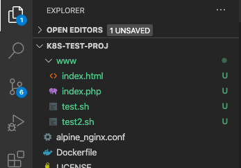

Ready to get going on the external storage question….

External Storage k8s
^^^^^^^^^^^^^^^^^^^^

John heads on to his next step in this endeavour by searching the internet on how to use external storage with k8s. He found an interesting article on k8s and external storage: https://softwareengineeringdaily.com/2019/01/11/why-is-storage-on-kubernetes-is-so-hard/#:~:text=In%20production%20developers%20usually%20rely%20on%20external%20storage.&text=It%20uses%20control%20plane%20interfaces,storage%20and%20grant%20storage%20portability, but still not what he’s looking for. 

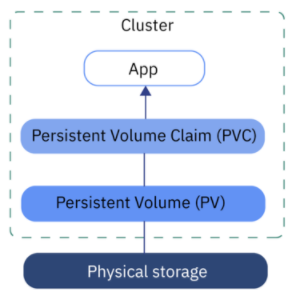

He searches on and finds an article that describes his situation, external storage, minikube and nfs for the external storage http://pietervogelaar.nl/minikube-nfs-mounts. 
After reading the article he has to make changes as he wants to get the container to mount the NFS, not via the minikube as that will not be available in a later state of the project... "Hmmm let’s see what I can do here and make the changes I need."

He sees mentioning Persistent Volume (PV) and Persistent Volume Claim (PVC). He copies the lines in the articles in his VC and sees if he can "translate" the used parameters towards his environment and saves the file as ``nginx-pv_pvc-k8s.yaml``.

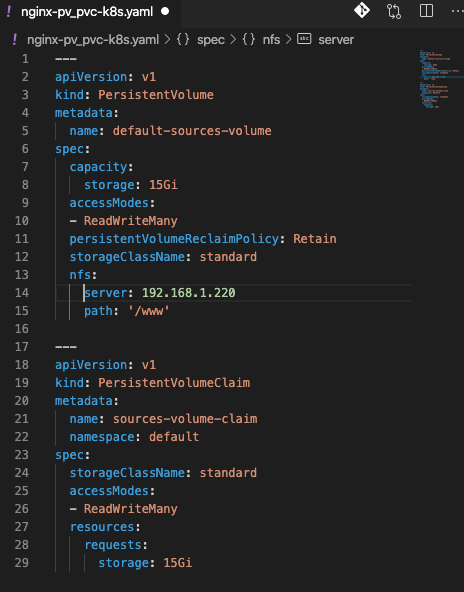

He changed the IP address to his NFS server’s IP Address and the path to the export he has defined earlier on the NFS server.

In the terminal panel in this VC he uses the command ``kubectl apply -f nginx-pv_pvc-k8s.yaml`` to see if k8s accepts the yaml file…

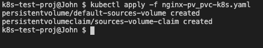

"Hmm it looks like k8s have created the two resources. Let’s check if it has...”. John runs ``kubectl get pv`` to see if the persistent volume is there and ``kubectl get pvc`` for the claim….

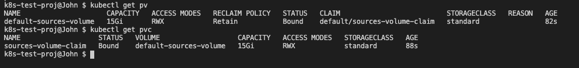

"Yep they are there up and running and ready to be used... Great!!"

Now let’s see what needs to be changed in the deployment so we are using the Persistent Volume Claim...

John copies his earlier created deployment into a new file and saves it as ``nginx-deployment-nfs-k8s.yaml``. He changes the yaml in a few places. He adds ``volumeMounts`` under that containers section and adds ``volumes`` under the spec section of the yaml file.
In the ``volumes`` part of the yaml file he defines what the name is that the volume should be known as in the yaml file and which pvs needs to be used by its given name in the earlier run yaml file.
The ``volumeMounts`` part of the yaml file is where the nfs (read pvc) needs to be mounted in the container by using the name of the pvc as mentioned in the ``volumes`` part of the section.

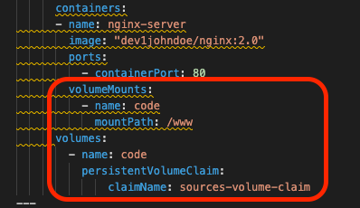

He knows that the container’s nginx config is having */www* as its root location for the files. The name of the ``volumeMount`` is using a volume called ``code``. That name is defined in the *volumes* section. It is under *volumes* "mounted" to the *pvc* called ``source-volume-claim``.

Now all should be there and he is ready to get the yaml file being deployed. He deletes the earlier created deployment by using ``kubectl delete -f nginx-deployment-k8s.yaml`` to make sure that the minikube is clean. After the command has runs, he checks the environment by using ``kubectl get pods``, ``kubectl get services`` and ``kubectl get deployments`` to make sure all has been cleaned.

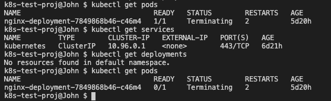

He reruns ``kubectl get pods`` until there ae no pods anymore available and runs the command to get his new deployment running ``kubectl apply -f nginx-deployment-nfs-k8s.yaml``. Using the known commands he checks to see what is happening...

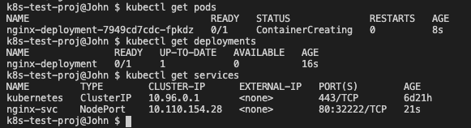

All good so far. After a while John reruns the command ``kubectl get pods`` for the pod status and still sees that the pod is in ``ContainerCreating`` status and doesn’t change... "Hmmmm not good... Let’s troubleshoot." He runs ``kubectl describe pod nginx-deployment`` and sees issue! The NFS server is not allowing connections!. 

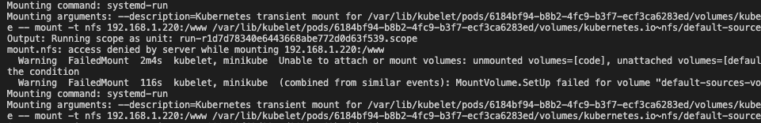

"Ah that makes sense now why the container is not up and running yet..."
He heads over to the NFS server using ``ssh root@192.168.1.220`` see what the server is throwing for errors. He runs ``tail -f /var/log/messages`` and see that there is a mention of an invalid port.

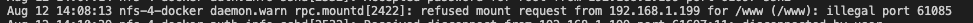

On the internet he quickly found the answer… https://serverfault.com/questions/107546/mount-nfs-access-denied-by-server-while-mounting after he added the ``insecure`` parameter to the ``/etc/exports`` file and also commented anything else out in the file using the # sign. He ran ``exportfs -r`` to have the nfs server reload its exports and headed back to his minikube environment.

He ran ``kubectl get pods`` and found that the pod is running now...

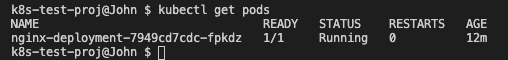

Also ``kubectl describe pods nginx-deployment`` shows a started container.

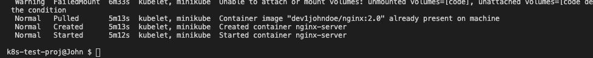

"Hmmmmm so the order of starting containers using external storage is to first mount the storage, then get the container, if not local, from the registry, and then start it... Good to know!"

The moment of truth has arrived!!!
^^^^^^^^^^^^^^^^^^^^^^^^^^^^^^^^^^

John cannot remember the name of the service and runs ``kubectl get services`` to make sure he has the correct name. 
The name of the service is nginx-svc. He then runs ``minikube service nginx-svc`` to expose the service to the outside world. He expects the following:

1. A browser opening up that is connecting to an IP address, but port 3222 (as defined in the YAML file)
2. The content of the index.php and not 403 error pages.

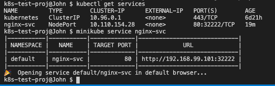

After the command, a browser window opens, on port 3222 AND he sees the index.php result in the browser! 

.. figure:: images/16.png

"Yes, yes, yes!!! It worked!"

Ingress setup
^^^^^^^^^^^^^

"All is good, but there is something missing. As we’ll want to run on a 'none minikube' environment, how do I get the application accessible from the outside world? How do I get that going??" John searches the internet and finds a video on Youtube from the lady Nana he found earlier and looks at the video (https://www.youtube.com/watch?v=80Ew_fsV4rM). She is explaining exactly his situation and follows the video. In short it is telling:

- "Install" and Ingress Controller
- Create an Ingress Yaml file that holds "routing" based on the path of the URL (part after the domain name)

Install the Ingress controller in Minikube
^^^^^^^^^^^^^^^^^^^^^^^^^^^^^^^^^^^^^^^^^^

As John is using the minikube, like in the video, he runs the command that has been shown in the video; ``minikube addons enable ingress``.

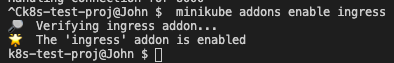

So that seems to work. Now the next step.

Create a ingress rule yaml
^^^^^^^^^^^^^^^^^^^^^^^^^^

In VC John created a new file called ``nginx-ingress.yaml`` and typed the following into it...

.. code-block:: yaml

    apiVersion: networking.k8s.io/v1beta1
    kind: Ingress
    metadata:
    name: nginx-ingress
    namespace: default
    spec:
    rules:
    - host: k8s.local
    http:
        paths:
        - backend:
            serviceName: nginx-svc
            servicePort: 80

The service name came from the command he ran ``kubectl get service``. He runs the command ``kubectl apply -f nginx-ingress.yaml`` to see if everything is like he expected by following the video.

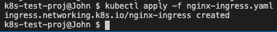

Ok that seem to have worked...
Now the video talks about getting the IP address using ``kubectl get ingress`` to see if the ingress rule is up.

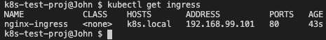

"It is up... Ok, now let’s go to the IP address in the browser and see what happens. Ok error... AAAhhhhh, man I forgot to make sure I can access it on domain name, not on IP address as stated in the Video...”. John changes the ``/etc/hosts`` file on his machine so that ``*k8s.local``* is being translated into ``*192.168.99.101``* by adding the line ``*192.168.99.101   k8s.local``*.
He then open the browser and types http://k8s.local and behold the page as seen earlier by using the minikube is working!!!!

Also he noticed that now the correct IP address, his local network, is now showing. Minikube is running in the Host Only network and the IP address of the host is indeed 192.168.99.1! So the script is definitely working!

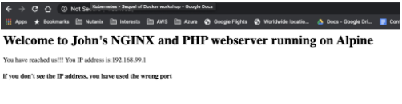

Great!!! Now let’s see what a small change in the index.php will do...
John changes the ``index.php`` in his www directory and adds the text "<H3>Running from minikube!!!</H3>" just after the </H1> tag in the file.

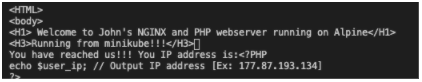

John saves the file and refreshes the browser and yes the expected data is being shown...

John is getting close to the end of his working day and recaps what he has done the last few days.

- Understand what Kubernetes is and why it is being called k8s
- Setup his testing environment and got all possible resources ready including minikube
- Ran a simple pod
- Got more resources ready, like VC, Github and some other tooling
- Rebuilt his container to the latest version
- Created YAML files for

  + PODs
  + Service
  + Combined service and pod into one YAML

- Manipulated the nodePort so there is pre-defined port being used
- Created a deployment 
- Started using external storage and the concept of Persistent Volume and Persistent Volume Claims
- Started to create YAML file for NFS use with a Persistent Volume and Persistent Volume Claim
- Create a deployment YAML file that uses a PVC
- Some troubleshooting on why a pod is not running
- Understanding and setup of Ingress in minikube
- Changes to the index.php are being seen by the NGINX server.

"Wow and all of that only in three days! From scratch to some basic understanding, including external storage and ingress know-how... Now let’s get it to the next level. Minikube is nice, but now the next level. Creating a multi node k8s cluster. But that is for tomorrow to start with. I’m done for today... Let’s get everything into Github so I have it ready for tomorrow. I guess I may need another environment.". John uses Git Desktop to get the latest updates pushed onto his github repo.
