.. _day4:

.. title:: Introduction to Kubernetes

Day 4 - Setting up a multi node test cluster
============================================

John has been successful so far using minikube, now he wants to extend his knowledge as Minikube is not really production ready. Also normal environments would consist of multiple nodes together that form a cluster. So he wants to test this, again on a local system, no cloud or dedicated hardware as it should still be as cheap as possible...

Introduction
------------

To get ready for today's part of the project John has set for him self the following actions:

- Creating a multi-node cluster
- Deployment of the earlier created YAML files in the Newly created Cluster
- Deploy the Ingress Controller and Ingress rules

Creating a multi node cluster
^^^^^^^^^^^^^^^^^^^^^^^^^^^^^

As the article he read earlier is way too much work, he is trying to get a more "scripted" way of installation of a multi node cluster.
After doing some searches he found kops. Now that seems to be a solution. While reading further, he read that kops is handy in an AWS environment. As he doesn’t have that he searches on and finds kubeadm. This can be installed on VMs and be used on a lot of different platforms. As he is used to Ubuntu 18 he will be using that as the platform of choice.
He read two articles, https://kubernetes.io/docs/setup/production-environment/tools/kubeadm/install-kubeadm/ and https://phoenixnap.com/kb/install-kubernetes-on-ubuntu. He combined the articles as they seem to overlap, but have some differences on the installation way, or are missing some part. Example is that the kubernete.io article is referring to docker and other items, where the second article has them described in detail.

Installing the VMs
^^^^^^^^^^^^^^^^^^

Using an existing virtualisation platform he installed three VMs. They are based on:

- 2vCPU per VM
- 2 GB RAM per VM
- 20 GB HDD
- CDRom mounted with the Ubuntu 18.04 iso, he already had it downloaded, but you never know... http://releases.ubuntu.com/18.04.4/ubuntu-18.04.4-live-server-amd64.iso
- Network that can go onto the internet. This due to pulling installation and container images. John set the network to bridge.
- Default installation with OpenSSH-Server included.

Naming of the VMs:

#. Master: k8s-m1
#. Worker 1: k8s-w1
#. Worker 2: k8s-w2

Configuring the VMs
^^^^^^^^^^^^^^^^^^^

Now that the VMs are installed he wrote down the hostname, the k8s role and the IP address of the three VMs in a table including hostname they should be.

.. list-table::
   :widths: 20 20 20
   :header-rows: 1
    
   * - Name    
     - Role K8s
     - IP
   * - k8s-m1
     - Master
     - 192.168.1.157
   * - k8s-w1
     - Worker 1
     - 192.168.1.169
   * - k8s-w2
     - Worker 2
     - 192.168.1.150

Now following the second article there are steps that need to be run on all nodes in the k8s cluster before and including kubeadm.
As he has three nodes running, he found tmux to make his life easier. Tmux is capable of running commands at the same time and only typing at once! That will save a lot of time... He installed it using https://linuxize.com/post/getting-started-with-tmux/ and https://blog.amjith.com/synchronize-panes-in-tmux for the synchronization of the panes in tmux.

He starts ``tmux`` from his terminal session. After tmux is running he uses ``<CTRL-B>+"`` to split his screen horizontally and then ``<CTRL-B>+<ARROW DOWN>`` to get to the lower half of his screen and ``<CTRL-B>+%`` to split the lower half vertically.

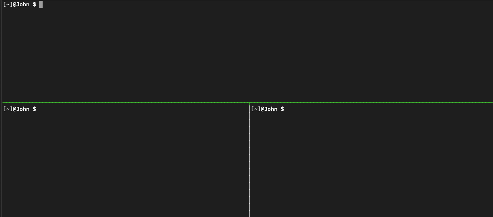

Using ``<CTRL>+B+<ARROW KEYS`` he navigates to the top panel and logs in to his master node using ``ssh john@<IP-ADDRESSES>`` (according to the table) and then the password so he gets the prompt from the nodes. He then logs into the workder nodes using ssh in the other two panes. For selecting another pane he uses ``<CTRL-B>+<ARROW KEYS>`` to move around.

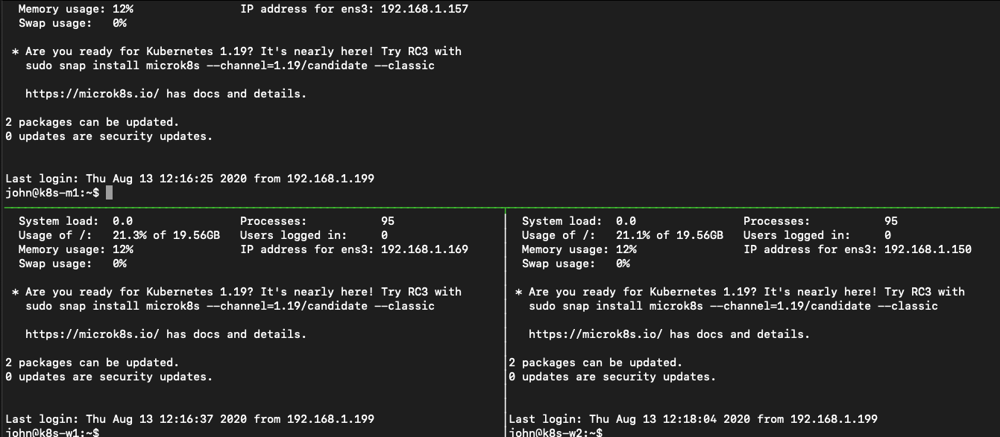

He makes sure that the top pane (his master) is active by using the ``<CTRL-B>+<ARROW KEY>`` to navigate to that pane. 

The following to be run commands that need to be run can be clustered into a few topics:

- Setting the naming correct of the hosts
- Pre-requirements for the installation of kubeadm
- Install kubeadm, configure the O/S and initialize the clusters
- Install internal kubernetes networking
- Add nodes to the cluster
- Install needed part of the O/S

Setting the naming
^^^^^^^^^^^^^^^^^^

Per VM, he runs the following commands so the Ubuntu 18 server keeps its name even after a reboot. ``sed -i 's/preserve_hostname\:\ false/preserve_hostname\:\ true/g' /etc/cloud/cloud.cfg``. Then he uses ``sudo hostnamectl set-hostname <HOSTNAME>`` , provided the password, to set the correct name of the node and reboots using ``sudo reboot``. After the machine came back up he ssh-ed back into the node from the tmux pane.

Pre-requirements for kubeadm installation
^^^^^^^^^^^^^^^^^^^^^^^^^^^^^^^^^^^^^^^^^

As he now needs to run commands across all nodes he is running the following to activate to synchronize the panes ``<CTRL-B>:setw synchronize-panes``.

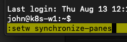

He tests it by typing ``clear`` so the panes are cleared and to see it works... Yep that worked!!! 

Ok, now to get to the real work. He runs the following commands to get the pre-requirements for the kubeadm installed ready.

- ``sudo su -``, that way he doesn’t have to use the password while installing the packages and configuration changes and provides the password when asked for.
- from https://kubernetes.io/docs/setup/production-environment/tools/kubeadm/install-kubeadm/ so the iptables firewall can read the bridged traffic which is needed for the k8s cluster:
    +
        .. code-block:: bash
            
            cat <<EOF | sudo tee /etc/sysctl.d/k8s.conf
            net.bridge.bridge-nf-call-ip6tables = 1
            net.bridge.bridge-nf-call-iptables = 1
            EOF

    + sudo sysctl --system

- Installing Docker

  + apt-get update
  + apt install -y docker.io
  + systemctl enable docker.service

Install kubeadm, configure the O/S and initialize the cluster
^^^^^^^^^^^^^^^^^^^^^^^^^^^^^^^^^^^^^^^^^^^^^^^^^^^^^^^^^^^^^
Still in the synchronized panes setting in tmux he runs the following commands to get kubeadm installed (https://kubernetes.io/docs/setup/production-environment/tools/kubeadm/install-kubeadm/
):

- apt-get install -y apt-transport-https curl
- curl -s https://packages.cloud.google.com/apt/doc/apt-key.gpg | sudo apt-key add -
- 
  .. code-block:: bash
    
    cat <<EOF | sudo tee /etc/apt/sources.list.d/kubernetes.list
    deb https://apt.kubernetes.io/ kubernetes-xenial main
    EOF

- apt-get update
- apt-get install -y kubelet kubeadm kubectl
- apt-mark hold kubelet kubeadm kubectl
- swapoff -a && sed -i 's/\/swap/#\/swap/g' /etc/fstab, to disable swap in Ubuntu

As the rest of the commands need to be run on just the master, John stops the synchronized panes by running the same command as he used to turnit on. ``<CTRL-B>:setw synchronize-panes``.

He types ``clear`` and sees that only the active screen is clearing its screen.

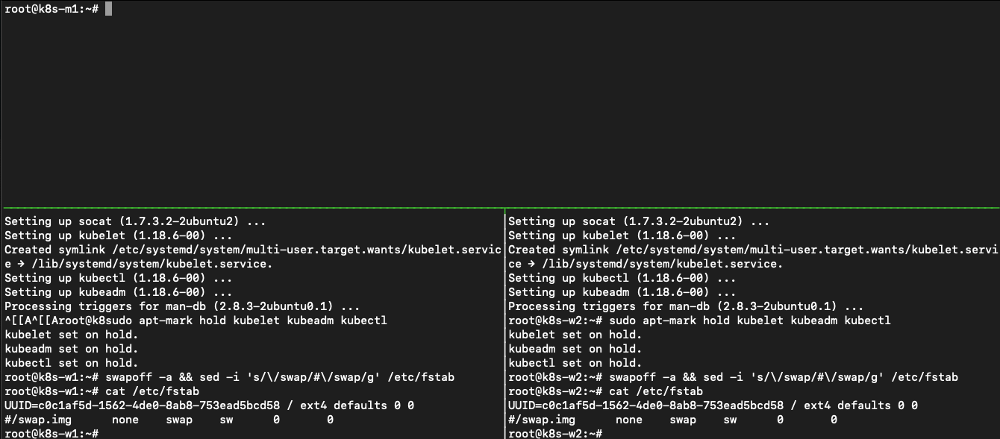

His master machine seems to have two network ip addresses, so https://kubernetes.io/docs/setup/production-environment/tools/kubeadm/create-cluster-kubeadm/ is telling that the the kubeadm init command needs to have an extra parameter. He runs ``kubeadm init --apiserver-advertise-address 192.168.1.157 --pod-network-cidr=10.10.100.0/24`` the *--pod-network-cidr* is providing the k8s internal network via which the pods can talk to each other if needed. 

.. note::
    This command can take a while as it pulls images from the internet!  

After the command has run John sees a line he seems to need to get worker nodes added to the k8s master node. 

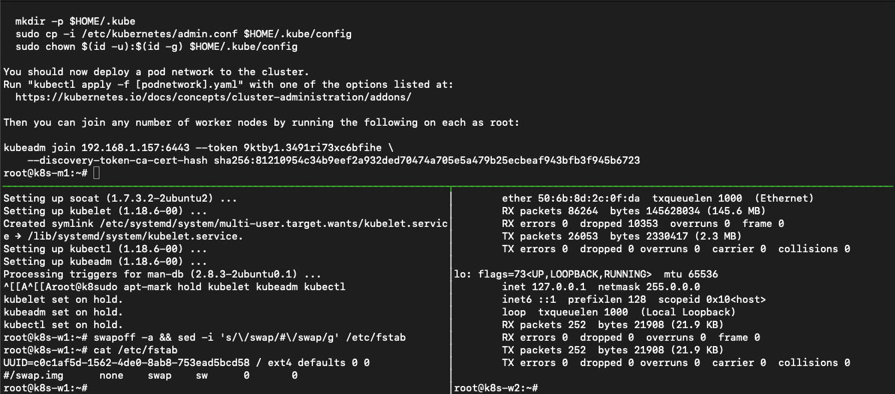

Also he sees that he needs to run some extra commands so he can manage the cluster using ``kubectl``, just like he used with minikube. He runs the commands on his masternode.

.. code-block:: bash

    mkdir -p $HOME/.kube
    sudo cp -i /etc/kubernetes/admin.conf $HOME/.kube/config
    sudo chown $(id -u):$(id -g) $HOME/.kube/config

He then runs ``kubectl get nodes`` to see that the config is ok to be working with. He sees that a reply from the cluster, so he can "talk" to the server. 

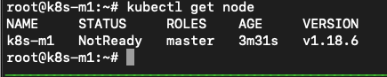

The master is not yet ready, but that will not take a long time...

Install internal kubernetes networking
^^^^^^^^^^^^^^^^^^^^^^^^^^^^^^^^^^^^^^

The article https://phoenixnap.com/kb/install-kubernetes-on-ubuntu carries on using the flannel network as the overlay network. John runs the same command as in the article on his master node ``kubectl apply -f https://raw.githubusercontent.com/coreos/flannel/master/Documentation/kube-flannel.yml`` and uses the ``kubectl get pods --all-namespaces`` to see all pods are in the running state. 

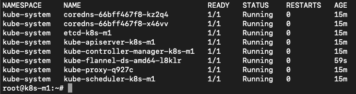

All pods seem to be ok. Next step adding worker nodes....

Add nodes to the cluster
^^^^^^^^^^^^^^^^^^^^^^^^

During the kubeadm init command he got a long command back that needs to be run on the worker node so they can be added to the cluster. John runs the command on the two workers.

Sill in tmux, he uses the <CTRL-B>+<ARROW KEYS> to navigate to the respective ssh sessions of the worker nodes where he runs ``kubeadm join 192.168.1.157:6443 --token 9ktby1.3491ri73xc6bfihe --discovery-token-ca-cert-hash sha256:81210954c34b9eef2a932ded70474a705e5a479b25ecbeaf943bfb3f945b6723`` as stated by the ``kubeadm init`` command. After he ran the command on the workers he navigates to the master node and runs ``kubectl get nodes`` to see if they are seen in the cluster.

.. figure:: images/08.png

And they showed up. Ok now the cluster is almost ready. Let’s just set some labels to the nodes so we can see that the other machines are seen as a worker. He runs, from the masternode, ``kubectl label node k8s-w1 node-role.kubernetes.io/worker1=worker`` and ``kubectl label node k8s-w2 node-role.kubernetes.io/worker2=worker``. He reruns ``kubectl get nodes`` and sees that the two nodes are now shown as workers.

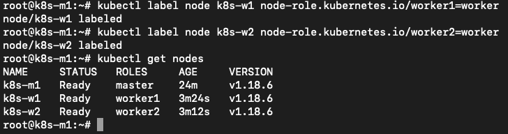

Now the cluster is ready to get some workloads!

Install needed part of the O/S
^^^^^^^^^^^^^^^^^^^^^^^^^^^^^^

As John’s application is using NFS for external storage, we need to make sure the O/S has support for that. This is by default not the case, so John needs to install it.

He re-enables the synchronized panes again so he only has to type it once. He types clear as a test, and sees that all panes are cleared. 
Now he installs the nfs client using ``apt install -y nfs-common``. All the panes run the installer and are ready after a few seconds. 

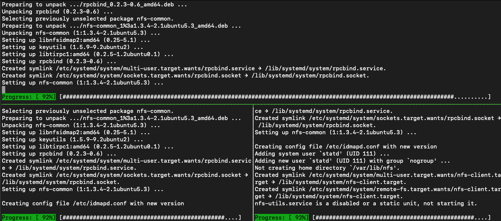

He then disables the synchronize-panes again as he only needs to run commands now on the master node. After he has stopped the synchronization, he wants to have his master node in a bigger screen. He navigates to the panes where the master is running and hits ``<CTRL-B>+z`` to maximise the screen.

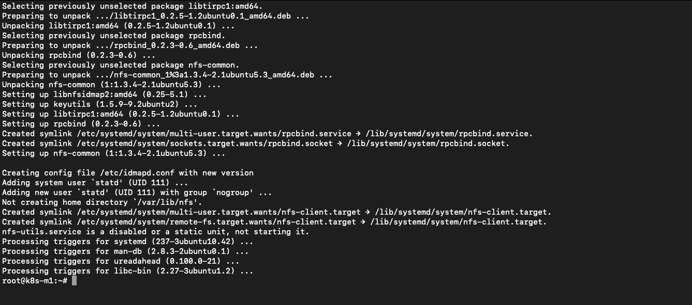

Rerunning the <CTRL-B>+z shows the other panes again, so all good if we need to switch…..

Deploying John’s application
^^^^^^^^^^^^^^^^^^^^^^^^^^^^

Yesterday John pushed the latest changes onto his github repo so he could use it on other machines. On the master he runs ``git clone https://github.com/dev1johndoe/k8s-test-proj.git`` so he has his files local on the master. Now that he has got his files local on the master, he runs the following commands to get everything deployed as he had yesterday:

#. cd k8s-test-proj
#. ``kubectl apply -f nginx-pv_pvc-k8s.yaml``; this deploys his PV and PVC he needs for the external storage
#. ``kubectl apply -f nginx-deployment-nfs-k8s.yaml``; the deployment of his container and according service

He sees that the cluster has created the objects

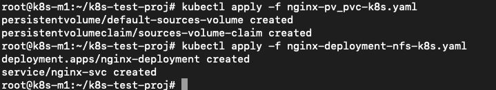

He runs ``kubectl get all`` to see if they are running.

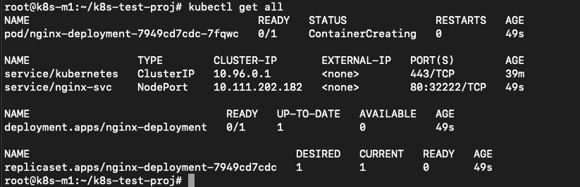

The deployment is in ``ContainerCreating`` status, so he runs the command again and again. The status doesn’t change... He starts troubleshooting by running ``kubectl describe pod nginx-deployment-7949cd7cdc-7fqwc`` (name of the POD from the nginx-deployment yaml) to get the events of the pod. In there he sees error about flannel. 

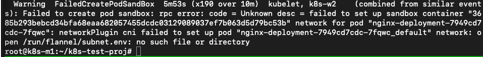

He then looks at the flannel pods as they have been deployed as a daemonset (pod runs on ALL node in the cluster) by the flannel yaml. He runs ``kubectl get all --all-namespaces`` to see everything that is running/deployed/etc. on the k8s cluster. He sees that two of the flannel pods are in ``CrashLoopBackOff`` status. 

He gets the name of the crashing pods and runs ``kubectl describe pod kube-flannel-ds-amd64-6j9pn`` to see what is going on...

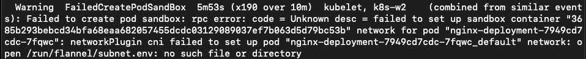

The error is the same error on the pod when he ran the ``kubectl describe pod nginx-deployment-7949cd7cdc-7fqwc``. He sees the same errors on the other pod of the flannel pod. The frist he does is to see if he can solve at least the issue on one of the nodes. The ``kubectl logs nginx-deployment-7949cd7cdc-7fqwc -n kube-system`` shows a lead to the issue:

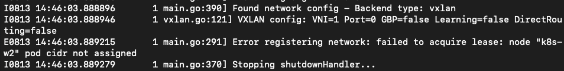

A quick search on the Error messages brings him to https://stackoverflow.com/questions/52098214/kube-flannel-in-crashloopbackoff-status. In that article it seems that the flannel was not able to read some information from the node. The solution is also written to the problem. As it isn’t working, there is not much that could go wrong. Still no production, so let’s see what happens... He runs on the master node the two commands that have been put in the article: ``sudo cat /etc/kubernetes/manifests/kube-controller-manager.yaml | grep -i cluster-cidr`` to get the information which is needed in the second command. The returned information is quickly returned and he runs with adding the correct information to the second command ``kubectl patch node k8s-w1 -p '{"spec":{"podCIDR":"10.10.100.0/24"}}'``

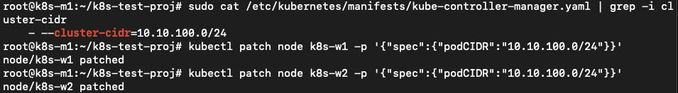

"It seems to have done something in the cluster. Let’s wait if it has solved the issue..."
He runs a few times ``kubectl get all --all-namespaces`` and sees that one after the other the flannel pods are getting in the running status.

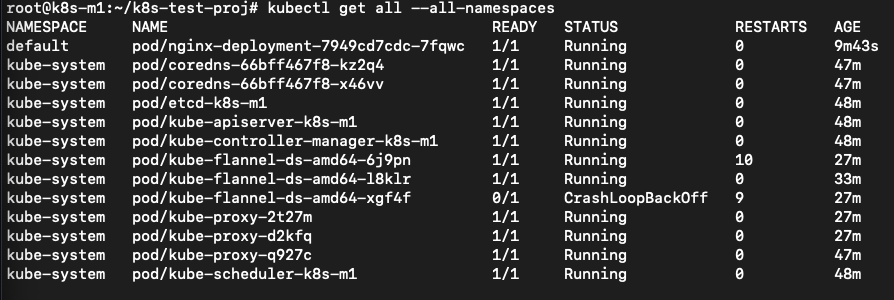

Ok now that should have solved my issues. Let’s see if the nginx pod is running by using ``kubectl get pod``...

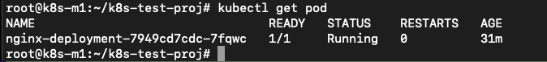

"Yes.. So now our pod running. ``kubectl get all`` is showing exactly the same information."

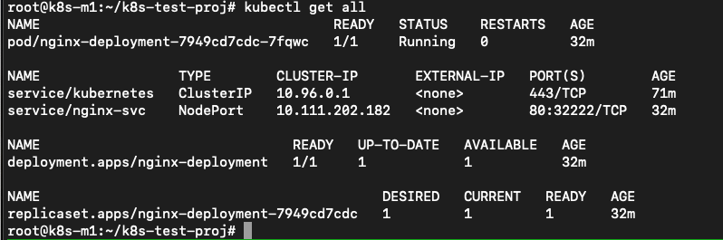

Ok now let’s see where the pod and the services are pointing to in the cluster.
John runs ``kubectl get pod -o wide`` and ``kubectl get svc -o wide`` to get the required information.

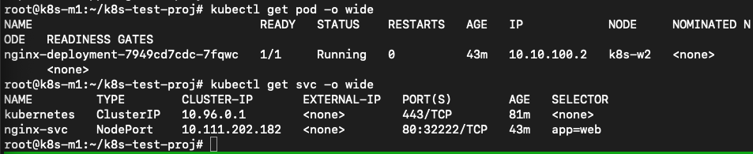

He combines the node from the pod line with the port 32222 from the service command and opens a browser and points it towards http://192.168.1.150:32222 (k8s-w2 is running at 192.168.1.150). This opens his know page.

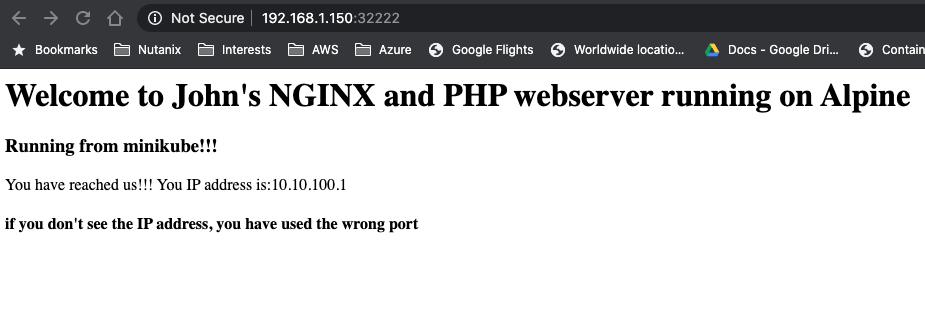

He also wants to make sure the nfs in the deployment works, so he’s mounting the www location on the nfs server on his master node by using ``mount -t nfs 192.168.1.220:/www www``. The last www came from the k8s-test-proj folder he grabbed using git clone...

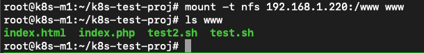

He then changes the index.php using vi index.php by exchanging the minikube text by k8s and saves the file. He refreshes the browser and sees that the change is shown...

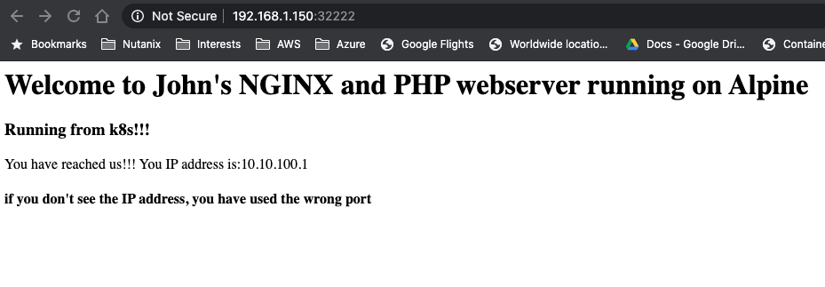

He still sees that the IP address is being the internal IP address via the builtin kube proxy... Let’s change that!!!

K8s Ingress
^^^^^^^^^^^

As with minikube earlier, john wants to open our app to the outside world on port 80 and not via a node or whatever. For minikube he just added the nginx ingress addon and was quickly done. As the installation is a bit more difficult on a "normal" cluster, John searches the internet and sees an article that describes what needs to be done for a HAProxy Ingress Controller. Let’s follow that one. Seems nice to use something other than NGINX... https://haproxy-ingress.github.io/docs/getting-started/ He follows the article and runs the commands:

.. code-block:: bash

    kubectl create -f https://haproxy-ingress.github.io/resources/haproxy-ingress.yaml
    kubectl label node k8s-w1 role=ingress-controller
    kubectl label node k8s-w2 role=ingress-controller
    kubectl -n ingress-controller get daemonset
    kubectl -n ingress-controller get pod

So far so good as all seem to be like the article.

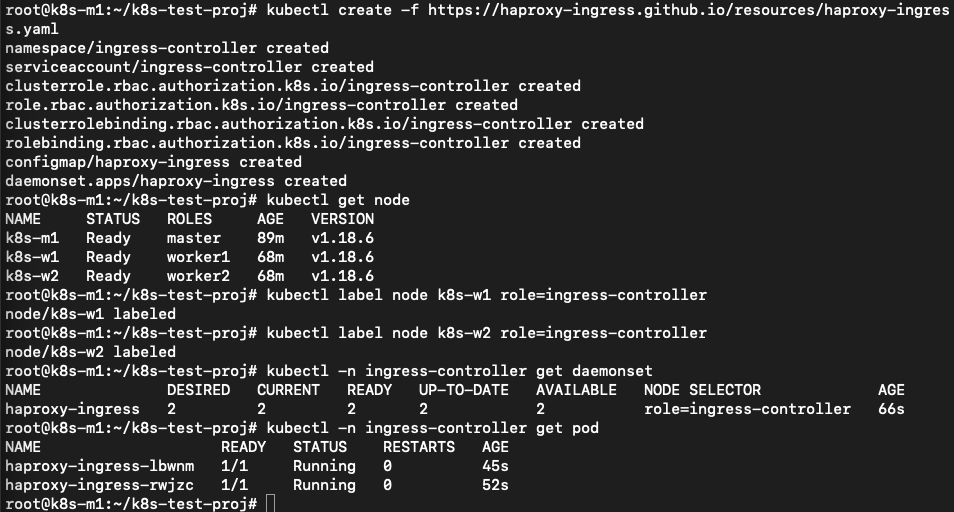

Now John needs to use the ``ingress.yaml`` created earlier. He checks the information by running the ``kubectl get all`` to check the service as that is where the ingress.yaml file is connecting too...

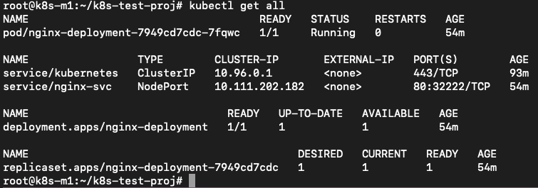

John runs the command ``kubectl apply -f nginx-ingress.yaml`` and waits...

The article is talking about the connection that it should be resolving to one of the nodes where the ingress-controller is running. As the command ``kubectl create -f https://haproxy-ingress.github.io/resources/haproxy-ingress.yaml`` created a new namespace (logical separation between objects) for the haproxy-ingress-controller, John type ``kubectl get ns`` to get the namespaces (ns). He recognizes the ingress-controller namespace and uses that to get the pods and the location where the ingress controllers are running.

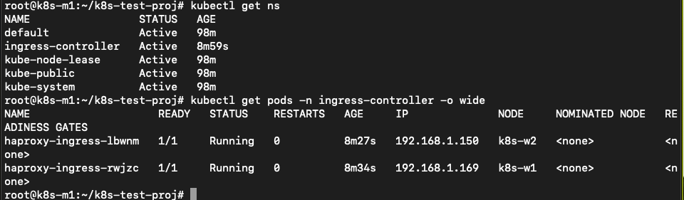

They are running on both the worker nodes. He changes the ``/etc/hosts`` file on the master with ``vi /etc/hosts`` and adds the line ``192.168.1.150 k8s.local`` and saves the file. The k8s.local is the value that has been defined in the nginx-ingress.yaml file so the system needs to be able to connect to that URL...

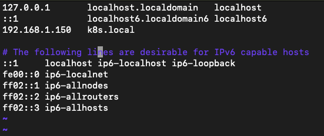

A ping to k8s.local is returning the IP address and replies.
John runs ``curl http://k8s.local`` and the command returns the expected data text based. Also the correct IP address is mentioned.

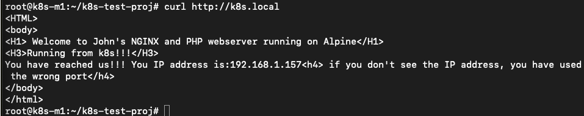

Yes all is working!!!! Yihaa... My app is now running with external nfs storage on port 80 with an ingress controller in a Kubernetes three node cluster!!

