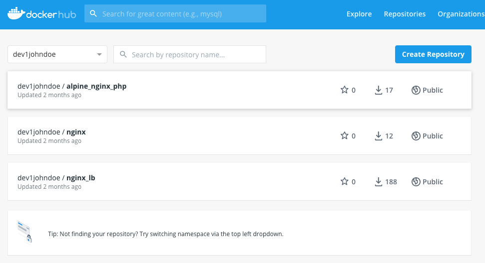

.. title:: Introduction to Kubernetes

.. toctree::
  :maxdepth: 2
  :caption: Labs
  :name: _labs
  :hidden:

  k8s/k8s
  day1/day1
  day2/day2
  day3/day3
  day4/day4
  day5/day5

.. _getting_started:

---------------------
Scenario introduction
---------------------
Welcome to a day in the life of an administrator called John. John is working for an organization that asks him to investigate if Kubernetes would be usable for their main workload. John already came to the conclusion that their main workload, a NGINX Load balancer and some NGINX based web servers, can be running as a container based workload (https://docs.google.com/document/d/1MABUIov_9WeTFKC4xG2eVSX_SrtGS1SbziU4OeHif1g). Today the application consists of Virtual Machines based on the Linux Distribution Ubuntu 18.04 LTS. John has the images of the container save and sound on his Docker hub account.

.. _requirements:

Requirements
++++++++++++

John has been asked to investigate the following set requirements by the organization:

- Use of the Docker images.
- Changing the configuration should be outside of the container, if it can be done.
- Changes to configuration and the web application should not be lost in case of a restart/reboot of the container
- A reboot of the host that serves the container should not impact the accessibility of the containerized web servers (read application).
- Update to the images or configuration must have:
    
  + A roll back path
  + No impact on application delivery

- Workloads should be able to scale out and in due to seasonal load on the application.
- Create the needed resources so they can be “transported” to AWS, GCP or Azure as all of the cloud providers have Kubernetes possibilities natively available.

John has no experience with Kubernetes, but has done in an earlier stage some research and discovered that setting up a Kubernetes cluster has been marked as not easy and decides then to go for Docker Swarm. Today that needs to change and see how difficult it is to get a Kubernetes cluster running. He has set the overall path to get his knowledge to a higher level:

- What is Kubernetes and why the k8s??
- What are pros and cons of Kubernetes vs Docker Swarm?
- How can I start to explore Kubernetes on my laptop?
- How do I interact with the k8s cluster?
- How can I use the already built container images?
- How to use external storage, so outside of the container?
  
  + For configuration?
  + For files that need to be “shared”?

This workshop is showing you how John steps through all the set items in his path..

Agenda
++++++

- What is Kubernetes and why k8s as the acronymn?
- Day 1 - Getting to understand how to run applications

  + General understanding
  + YAML Files for deployments
  + Build the test environment

- Day 2 - Getting the earlier build images up and running in k8s

  + Start the tes environment
  + Preparation for the project
  + Create YAML files
  + Pod or deployment?

- Day 3 - Getting the external storage in the container and ingress

  + Create a NFS server
  + Understand the external storage concept in k8s
  + Create Persistent Volumes (PV) and PV Claims (PVC)
  + Use of Ingress Controller and Ingress Rules

- Day 4 - Setting up a multi node test cluster

  + Create a Multi Node Cluster
  + Deployment of the earlier created YAML files in the Newly created Cluster
  + Deploy the Ingress Controller and Ingress rules

- Day 5 - Conclusion
